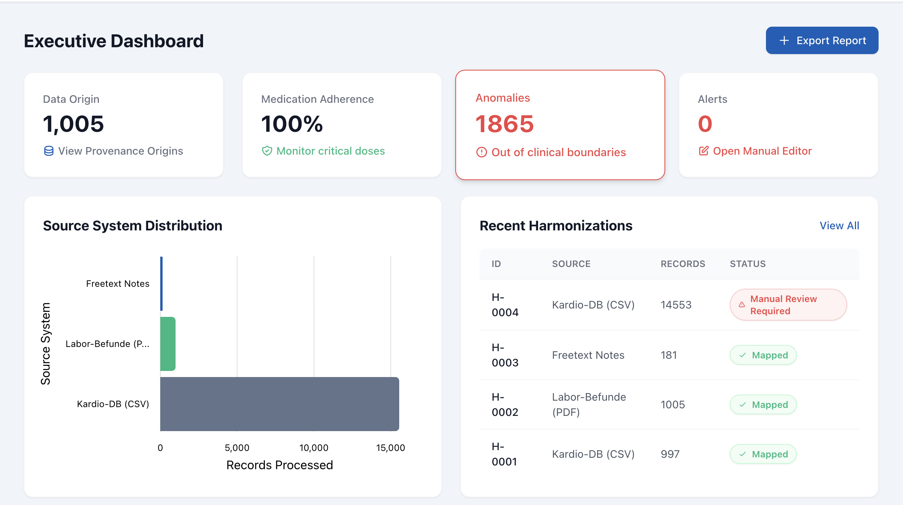
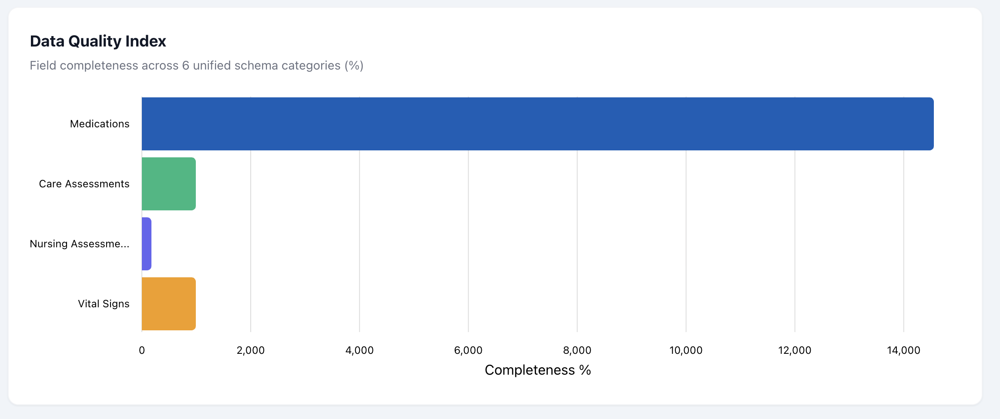
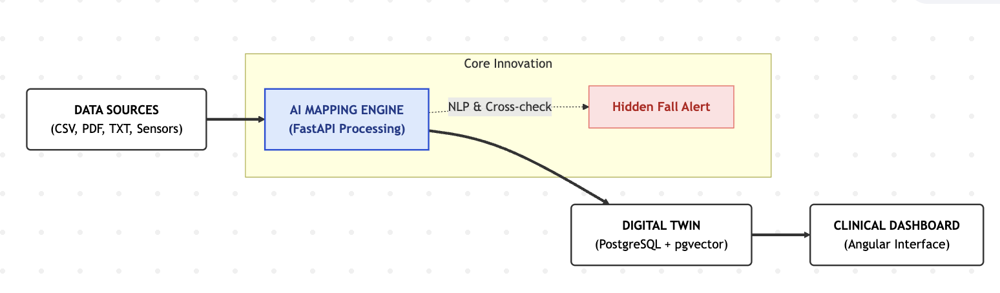

# Smart Health Data Mapping


A full-stack AI mapping engine that unifies fragmented healthcare data — Hospital Information Systems, EPS records, nursing notes, and sensor telemetry — into a single standardised SQL schema. Built as a hackathon MVP at START Hack 2026.

---

## Screenshots

### Executive Dashboard — KPIs & Source Distribution



### Data Quality Index



---

## What it does

Healthcare data is fragmented across incompatible systems. This engine acts as a central normalisation and intelligence layer — ingesting heterogeneous files, resolving structural inconsistencies, and surfacing clinical anomalies that would otherwise go undetected.

**Ingestion** — drag-and-drop interface for CSV, Excel, and PDF exports, routing each file type to the appropriate backend pipeline.

**Processing** — structural mapping, duplicate removal using last-record timestamp logic, and value neutralisation (corrupted strings like `'unknow'` or `'Missing'` converted directly to `NULL` for clean database ingestion).

**Clinical intelligence** — NLP extraction deconstructs free-text nursing daily reports to identify clinical entities and incident keywords. A rules engine parses lab reference ranges (`_ref_low`, `_ref_high`) and flags out-of-bounds values with severity-graded alerts.

**Hidden Fall Service** — the most novel feature: a cross-check synchronisation between human input and machine telemetry. If NLP detects a hazard keyword (`sturz`, `fall`, `floor`) in a nursing report but the corresponding motion sensor registers `fall_event_0_1 = 0`, a High Severity "Sensor Conflict" alert is triggered. Catches discrepancies neither system would surface alone.

**Visualisation** — Angular dashboard with real-time KPIs (Data Quality Index, Medication Adherence, Anomaly Count), source distribution charts, an Anomaly Explorer with validate/dismiss workflow, and one-click PDF report export via html2canvas and jsPDF.

---

## Architecture



Data sources (CSV, PDF, sensor telemetry) flow into the FastAPI mapping engine, which runs NLP extraction and the Hidden Fall cross-check service. All unified records are persisted to PostgreSQL + pgvector and surfaced through the Angular clinical dashboard.

---

## Quickstart (Docker)

The entire stack — frontend, backend, and database — is orchestrated via Docker Compose.

### Prerequisites

- Docker Desktop v4.x or later
- Ports `80`, `8000`, and `5444` available on the host

### 1. Clone and configure

```bash
git clone https://github.com/RickySandi/smart-health-mapping.git
cd smart-health-mapping
cp .env.example .env
# Edit .env with your preferred credentials
```

### 2. Launch

```bash
docker compose up --build -d
```

Docker Compose builds the frontend and backend images, pulls `pgvector/pgvector:pg16`, and starts all three services with health-check ordering.

### 3. Initialise pgvector (first run only)

```bash
docker compose exec db psql -U postgres -d health_data -c "CREATE EXTENSION IF NOT EXISTS vector;"
```

This step only needs to be run once — the extension persists with the database volume.

### Service URLs

| Service | URL |
|---|---|
| Frontend Dashboard | http://localhost |
| Backend API (Swagger UI) | http://localhost:8000/docs |
| Database | `localhost:5444` |

---

## Test Data

The `test_data/` directory contains five synthetic datasets designed to exercise each logic path independently.

| File | Feature tested | Expected outcome |
|---|---|---|
| `epaAC-Data-1.csv` | Duplicate handling & basic mapping | Deduplicates via last-record logic, neutralises `'Missing'` strings to `NULL` |
| `synth_labs_1000_cases.csv` | Clinical anomaly detection | Parses reference ranges, triggers High Severity alerts for out-of-bounds values (e.g. potassium) |
| `synthetic_nursing_daily_reports_en.csv` | NLP entity extraction | Categorises report topics, extracts critical incident keywords |
| `synthetic_device_motion_fall_data.csv` | Hidden Fall cross-check | Upload alongside nursing reports to trigger Sensor Conflict alerts on mismatches |
| `synthetic_medication_raw_inpatient.csv` | Medication timeline logic | Flags `ORDER` rows lacking `ADMIN` confirmation, escalates severity for critical drugs (e.g. anticoagulants) |

---

## Key Decisions & Findings

**The Hidden Fall Service is the most architecturally interesting component.** A single data source — nursing notes or sensor telemetry — can independently look clean while hiding a real incident. The cross-check only works because both sources are unified into the same schema at ingestion time. This is the core argument for a centralised mapping engine: individual source quality checks would never catch these discrepancies.

**pgvector was included for future extensibility, not current use.** PostgreSQL 16 handles all relational logic in the MVP. The pgvector extension is initialised and ready for embedding-based retrieval (e.g. semantic similarity search across clinical notes), but that layer is roadmap, not implemented. Using pgvector now avoids a schema migration later.

**Client-side PDF export was a deliberate design constraint.** In healthcare, data leaving the browser to a third-party rendering service raises compliance questions. html2canvas + jsPDF generate the audit report entirely in the browser — no server round-trip, no data transmitted to an external service.

**The rules engine uses explicit reference range parsing rather than a trained model** because clinical thresholds are not learned — they are defined by medical standards bodies. A ML-based anomaly detector would be opaque and harder to audit. Explicit rules are explainable, editable by clinical staff, and auditable in a regulatory context.

---

## Tech Stack

| Layer | Technology |
|---|---|
| Frontend | Angular 20, TailwindCSS, ngx-charts |
| Backend | FastAPI (Python 3.11), SQLAlchemy |
| Database | PostgreSQL 16 + pgvector |
| Reporting | html2canvas, jsPDF |
| Deployment | Docker Compose |

---

## Future Roadmap

- **HL7/FHIR integration** — replace static CSV uploads with real-time ingestion streams parsing HL7/FHIR payloads for cross-hospital interoperability
- **Embedding-based retrieval** — activate pgvector for semantic similarity search across clinical notes
- **Multi-tenant cloud deployment** — horizontal scaling to support concurrent institutions

---

## License

MIT — see [LICENSE](LICENSE).
